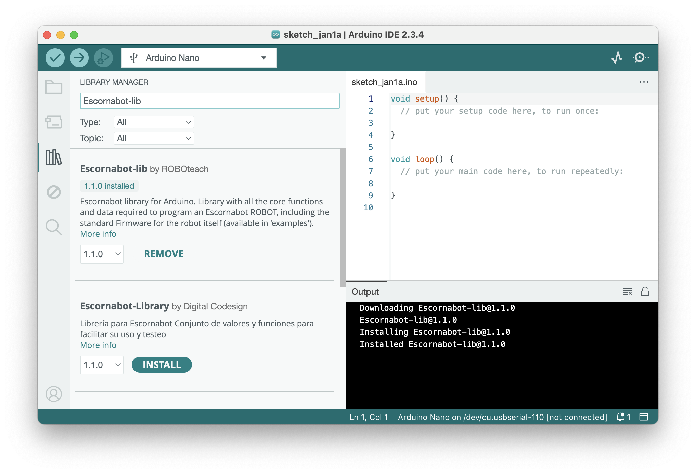

# Escornabot-lib
An **Escornabot Arduino library** created for [Luci](https://github.com/roboteach-es/escornabot-luci).

This library contains all the core functions and data required to program an [Escornabot ROBOT](https://roboteach.es/escornabot). One of the programs is the [**standard firmware**](examples/Firmware/) for the robot itself.


## Simple example

```cpp
#include <Escornabot-lib.h>
Escornabot luci;


void setup(){
	luci.init();
	luci.beep(EB_BEEP_DEFAULT, 100);
	luci.showKeyColor(EB_LUCI_COLOR);
	delay(1000);
}

void loop() {
	// advance
	luci.showKeyColor(EB_KP_KEY_FW);  // blue
	luci.beep(EB_BEEP_FORWARD, 100);
	luci.move(10.0);

	// turn
	luci.showKeyColor(EB_KP_KEY_TR);  // green
	luci.beep(EB_BEEP_TURNRIGHT, 100);
	luci.turn(90);
}
```

## Installation

1.  Download and install the [Arduino IDE 1.6 (or newer)](https://www.arduino.cc/en/Main/Software)
2.  Open the `Library Manager` from the menu `Tools → Manage Libraries...`
3.  Search the `Escornabot-lib` library using the input field
4.  Select the last version (from the dropdown combobox) and click `Install`

You can try now some of the examples from the menu `File → Examples → Escornabot-lib`.




## Escornabot
**Escornabot** is an **educational open-source and open-hardware ROBOT**, created in [Galicia in 2014](https://oshwdem.org/2014/11/se-acabo-pulpo/) and evolving since then.

From a functional perspective, it is a device composed of:

* an **Arduino**, typically a Nano (the *brains*)
* two 28BYJ-48 5V **stepper motor**s with its driver[s] (the *movement*)
* a 5V **passive buzzer** (the *sound*)
* a **LED**, or LEDs, or a NeoPixel now (the *light*)
* a 5 keys **analog keypad** (the *input*)
* an **energy source**, batteries or powerBank (the *power*)
* a **chasis** with two **wheels**, normally 3D printed (the *shape*)

arranged in a particular physical configuration that allows it to move and turn in a surface, do sound and light, and accept user input, to perform different tasks (typically used as a **programmable buttoned floor robot**).


## Documentation
This library source code is documented using [Doxygen format](https://www.doxygen.org/manual/commands.html), although no documention has been generated yet.

Meanwhile, in the [`examples`](examples/) folder, besides the [`firmware itself`](examples/Firmware/), there are several programs that may be useful to understand how it works.


## LICENSE

This work is licensed under the [GNU General Public License v3.0](LICENSE). All media and data files that are not source code are licensed under the [Creative Commons Attribution 4.0 BY-SA license](LICENSE-CCBYSA40).

More information about licenses in [Opensource licenses](https://opensource.org/licenses/) and [Creative Commons licenses](https://creativecommons.org/licenses/).
